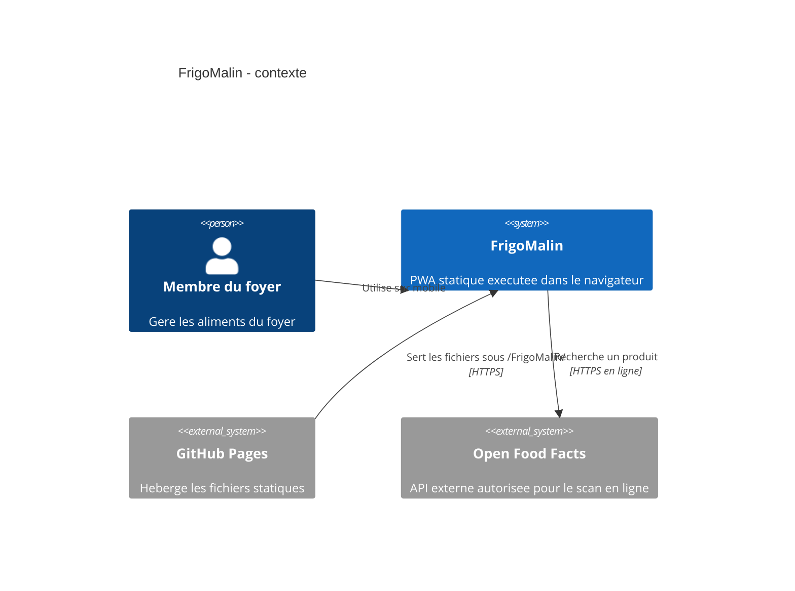
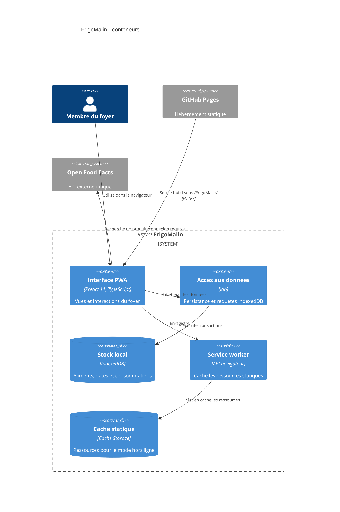

# ADR 0002 : Choix du framework UI

- **Statut :** Accepté
- **Date :** 2026-10-02

## Contexte et problème

FrigoMalin est une PWA statique publiée sur GitHub Pages sous `/FrigoMalin/`. Elle n’a ni backend ni comptes; les parcours essentiels fonctionnent hors ligne après le premier chargement. Le POC, prévu sur cinq jours, inclut le stock, les dates et la déclaration de consommation.

Le socle **Vite + TypeScript** est retenu pour le build et le langage. La présente décision porte uniquement sur le runtime UI; le routage est traité séparément dans l’ADR 0003.

## Facteurs de décision

- Réduire le temps d’implémentation et la complexité du POC.
- Structurer les vues et l’état d’interface de façon testable.
- Limiter le JavaScript livré sur mobile.
- Générer des ressources statiques compatibles avec GitHub Pages et le chemin `/FrigoMalin/`.
- Ne pas ajouter de dépendance réseau d’exécution, de backend ni de secret côté client.

## Options considérées

| Option | Taille indicative du runtime UI | Facilité de test | Adéquation au POC |
| --- | ---: | --- | --- |
| DOM natif avec TypeScript et Vite | 0 kB de runtime de framework | Bonne pour les fonctions pures; les tests d’interactions doivent vérifier directement le DOM et une convention de mise à jour d’interface reste à établir. | Peu de dépendances, mais la gestion d’état et les vues interactives reposent davantage sur du code maison. |
| Preact 11 avec TypeScript et Vite | Environ 4,8 kB gzip pour le paquet Preact seul. | Bonne : composants et état testables; un environnement DOM et des outils de test UI restent à choisir. | Modèle déclaratif à composants et faible runtime; la familiarité de l’équipe n’est pas documentée. |
| React 19 avec TypeScript et Vite | React 19.2 seul : environ 2,8 kB gzip; `react-dom` est à mesurer dans le build final. | Bonne : large écosystème de test et documentation. | Écosystème vaste; l’empreinte finale et le bénéfice pour ce POC doivent être mesurés. |

Les tailles sont des ordres de grandeur des paquets publiés, pas la taille du bundle FrigoMalin. Le build Vite réel peut différer selon les imports, les transformations et l’optimisation.

Sources : [Preact 11 - bundle](https://bundlephobia.com/package/preact@11.0.0), [React 19.2 - bundle](https://bundlephobia.com/package/react@19.2.0), [Preact - démarrage avec Vite](https://preactjs.com/guide/v11/getting-started), [Preact - TypeScript](https://preactjs.com/guide/v11/typescript), [React - documentation](https://react.dev/learn).

## Décision

Utiliser **Preact 11 avec Vite + TypeScript**. Vite compile l’application en fichiers statiques; Preact fournit le runtime UI à composants. Les données restent dans IndexedDB via `idb`, conformément à l’ADR 0001. Aucun choix de routeur n’est inclus dans cet ADR.

## Schéma C4 niveau 1 - Contexte

<!-- mermaid-checked: no \n, no em-dash/en-dash, no {} in labels, subgraphs are id["label"], arrows are -->|"label"|, all subgraphs closed by end, ids unique -->

## Schéma C4 niveau 2 - Conteneurs

<!-- mermaid-checked: no \n, no em-dash/en-dash, no {} in labels, subgraphs are id["label"], arrows are -->|"label"|, all subgraphs closed by end, ids unique -->

Vite est l’outil de build et n’est pas un conteneur d’exécution. Il produit les ressources statiques servies par GitHub Pages. Le service worker permet de servir ces ressources après le premier chargement; Open Food Facts reste indisponible hors ligne et ne bloque pas la saisie manuelle ni la consultation du stock.

## Conséquences

### Positives

- Les vues stock, dates et consommation peuvent être découpées en composants et partager l’état de façon déclarative.
- Le runtime UI reste compact par rapport à de nombreuses options de framework; sa taille réelle sera vérifiée dans le build Vite.
- La production reste un ensemble de fichiers statiques compatible avec GitHub Pages.
- Preact et TypeScript disposent d’une documentation officielle; les tests de composants pourront être ajoutés sans modifier le modèle de déploiement.

### Négatives

- L’équipe doit apprendre ou confirmer les particularités de Preact; sa familiarité actuelle n’est pas connue.
- Les tests UI nécessitent de choisir un environnement DOM et un outil de test, non décidés ici.
- Une dépendance ou un besoin ultérieur fortement lié à l’écosystème React pourrait réduire l’avantage de Preact.

## Conditions de réexamen

Reconsidérer ce choix si l’équipe possède une expertise React nettement supérieure et que le délai de cinq jours est menacé, si une dépendance nécessaire n’est pas compatible avec Preact sans `preact/compat`, ou si le build mesuré montre que Preact ne respecte pas le budget mobile. Ne pas choisir `preact/compat` sans mesurer son coût et vérifier le besoin.
