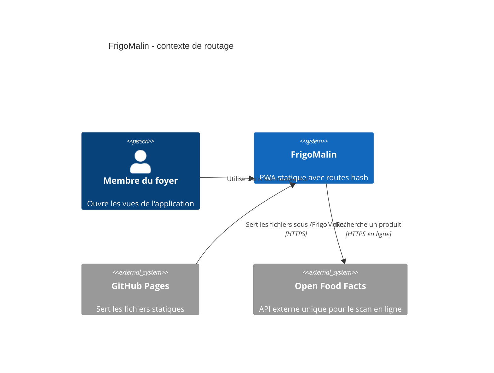
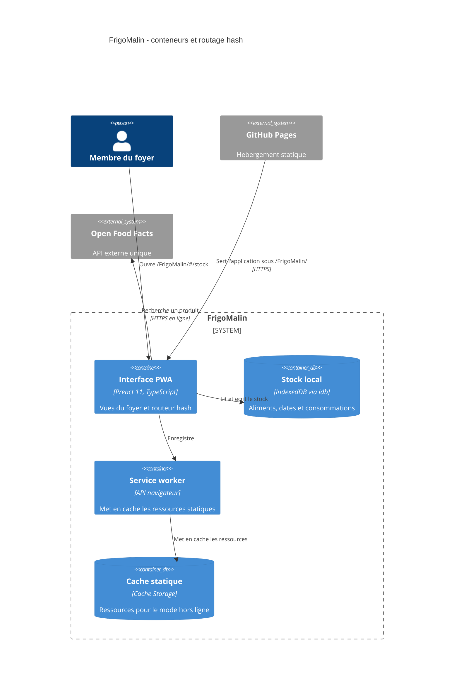

# ADR 0003 : Routage hash pour GitHub Pages

- **Statut :** Accepté
- **Date :** 2026-10-02

## Contexte et problème

FrigoMalin est une PWA statique déployée sur GitHub Pages sous `/FrigoMalin/`. L’application comporte plusieurs vues et doit pouvoir être rechargée hors ligne après son premier chargement. GitHub Pages documente les pages `404.html` pour les URL inexistantes, mais ne documente pas de réécriture de ces chemins vers le shell d’une SPA. Un fragment d’URL, lui, est traité par le navigateur et n’est pas envoyé au serveur.

Il faut choisir une stratégie de routage qui permet les liens directs et la navigation entre vues tout en restant compatible avec l’hébergement, le chemin de base et le service worker.

## Facteurs de décision

- Recharger ou ouvrir directement une vue sans requérir de réécriture serveur.
- Rester compatible avec `/FrigoMalin/` et le scope du service worker.
- Fonctionner hors ligne après le premier chargement en ligne.
- Limiter la complexité du POC de cinq jours.
- Garder des URL partageables et un historique navigateur cohérent.

## Options considérées

| Option | Avantages | Compromis |
| --- | --- | --- |
| Routage hash, par exemple `/FrigoMalin/#/stock` | La requête HTTP reste sur `/FrigoMalin/`; aucun fallback serveur n’est requis. Le navigateur laisse le fragment au code client. Liens directs et historique peuvent être gérés par l’application. | URL avec fragment, moins conventionnelles. Il faut gérer les changements de hash, l’historique et la convention de fragment sans conflit avec les ancres. |
| Routage par chemin et page `404.html`, par exemple `/FrigoMalin/stock` | URL plus conventionnelles et lisibles. | GitHub Pages sert la page personnalisée lorsque le chemin demandé est inexistant. Il faudrait y ajouter une stratégie de restauration vers l’application et tester le chargement des assets, le statut HTTP, le sous-chemin et le service worker. Le comportement devient plus délicat hors ligne. |

Sources : [GitHub Pages - page 404 personnalisée](https://docs.github.com/en/pages/getting-started-with-github-pages/creating-a-custom-404-page-for-your-github-pages-site), [MDN - fragment d’URI](https://developer.mozilla.org/en-US/docs/Web/URI/Reference/Fragment).

## Décision

Utiliser le **routage hash**, avec des routes telles que `/FrigoMalin/#/stock`, `/FrigoMalin/#/dates` et `/FrigoMalin/#/consommation`. Le routeur interprète le fragment côté client; le serveur continue à servir le shell statique sous `/FrigoMalin/`.

Cette décision ne choisit pas de bibliothèque de routage. Le routeur retenu devra respecter le chemin de base et fonctionner avec le service worker.

## Schéma C4 niveau 1 - Contexte

<!-- mermaid-checked: no \n, no em-dash/en-dash, no {} in labels, subgraphs are id["label"], arrows are -->|"label"|, all subgraphs closed by end, ids unique -->

## Schéma C4 niveau 2 - Conteneurs

<!-- mermaid-checked: no \n, no em-dash/en-dash, no {} in labels, subgraphs are id["label"], arrows are -->|"label"|, all subgraphs closed by end, ids unique -->

Le fragment ne change pas le chemin HTTP demandé au serveur. Le service worker et les assets restent sous le scope `/FrigoMalin/`. Il sert les ressources de la PWA hors ligne après le premier chargement; Open Food Facts nécessite une connexion et la saisie manuelle demeure disponible.

## Conséquences

### Positives

- Les rechargements et ouvertures de routes hashées redemandent le shell statique à `/FrigoMalin/` plutôt qu’un chemin serveur inexistant.
- Aucun mécanisme de repli `404.html` n’est requis pour le routage.
- Le routage reste côté client et compatible avec l’hébergement statique et le mode hors ligne, une fois l’application mise en cache.

### Négatives

- Les URL contiennent un fragment et sont moins conventionnelles que des chemins `/stock`.
- L’application doit gérer les changements de hash, le bouton Retour/Avancer et éviter les conflits avec des ancres HTML.
- Le bon fonctionnement dépend aussi de la configuration du chemin de base Vite et du scope du service worker.

## Risques

| Risque | Probabilité / impact | Signal de détection | Mesure de réduction |
| --- | --- | --- | --- |
| Une route hashée ne restaure pas la bonne vue | Faible à moyenne / moyen | Ouverture ou rechargement de `/#/dates` affiche une autre vue | Tester l’ouverture directe, le rechargement et les boutons Retour/Avancer. |
| Le fragment entre en conflit avec une ancre ou une convention future | Faible / faible | Navigation ou défilement inattendu | Réserver le fragment au routeur et documenter le format des routes. |
| Les assets ou le service worker ne respectent pas `/FrigoMalin/` | Moyenne / élevé | Erreurs 404 ou rechargement hors ligne impossible | Tester le build sous le préfixe publié, en ligne puis hors ligne. |
| Une exigence d’URL sans fragment apparaît | Moyenne / faible | Besoin produit de partager `/stock` plutôt que `/#/stock` | Réexaminer si les URL conventionnelles deviennent une exigence prioritaire et valider d’abord le fallback de GitHub Pages. |

Les probabilités sont des estimations initiales à confirmer par les tests du POC.

## Conditions de réexamen

Réexaminer cette décision si les URL sans fragment deviennent une exigence prioritaire et si une solution de fallback `404.html` est vérifiée avec GitHub Pages, Vite sous `/FrigoMalin/`, le service worker et les routes profondes. La nouvelle option devra préserver l’ouverture hors ligne après le premier chargement.
